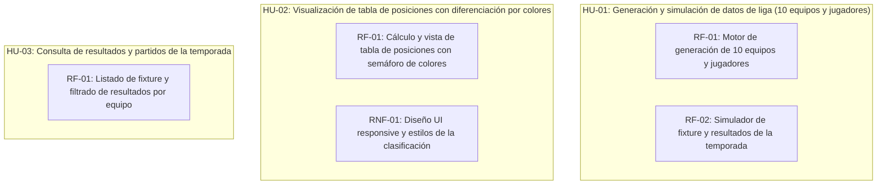

# Grafo de Dependencias -- prueba

_Generado automaticamente el 2026-09-15T19:43:10.170Z -- no editar a mano, se sobreescribe en cada publicacion._

```mermaid
graph TD
  subgraph US_1789500774004["HU-01: Generación y simulación de datos de liga (10 equipos y jugadores)"]
    REQ_1789501307396["RF-01: Motor de generación de 10 equipos y jugadores"]
    REQ_1789501323521["RF-02: Simulador de fixture y resultados de la temporada"]
  end
  subgraph US_1789500801469["HU-02: Visualización de tabla de posiciones con diferenciación por colores"]
    REQ_1789501339015["RF-01: Cálculo y vista de tabla de posiciones con semáforo de colores"]
    REQ_1789501354292["RNF-01: Diseño UI responsive y estilos de la clasificación"]
  end
  subgraph US_1789500818362["HU-03: Consulta de resultados y partidos de la temporada"]
    REQ_1789501384835["RF-01: Listado de fixture y filtrado de resultados por equipo"]
  end
```